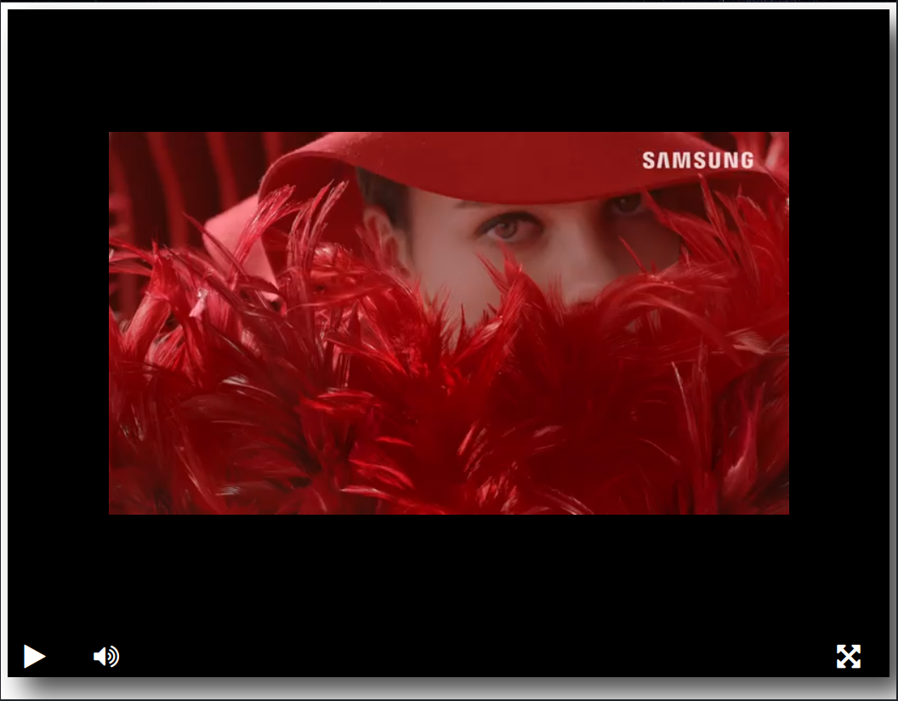

# Видео-плейер на HTML странице

*Видео-плейер на базе js-библиотеки  [Playable](https://wix.github.io/playable/)., встроенный в html-страницу*



## Как установить

Код является свободным, ты можешь установить его и пользоваться. 

Cкачай репозиторий к себе, запусти браузер и в адресной строке укажи полный путь к файлу index.html.

## Источник видео

По умолчанию плейер проигрывает видео по [этой ссылке](https://dvmn.org/media/filer_public/78/db/78db3456-3fd3-4504-9ed9-d2d1fd843c0b/highest_peak.mp4).

Если хочешь выбрать другое видео, то найди в index.html следующий код:

```html
<script type="text/javascript">
  createPlayer({
    elementId: 'player',
    src: 'https://dvmn.org/media/filer_public/d0/16/d016d9b8-4180-4bb9-ad83-0241f61627b8/samsung_demo_-_alive_in_color.mp4'
});
</script>
```
и замени ссылку аргумента `src` на свою. Ссылки должны заканчиваться расширением файла.

## Цель проекта

Код написан в образовательных целях на онлайн-курсе для веб-разработчиков [dvmn.org](https://dvmn.org/).